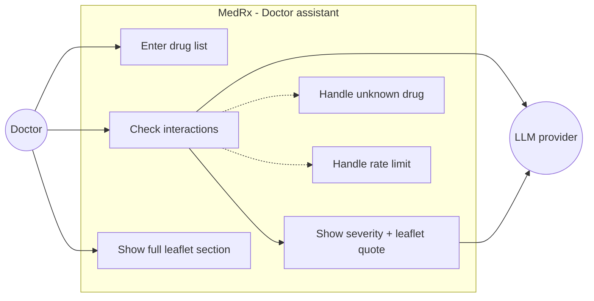
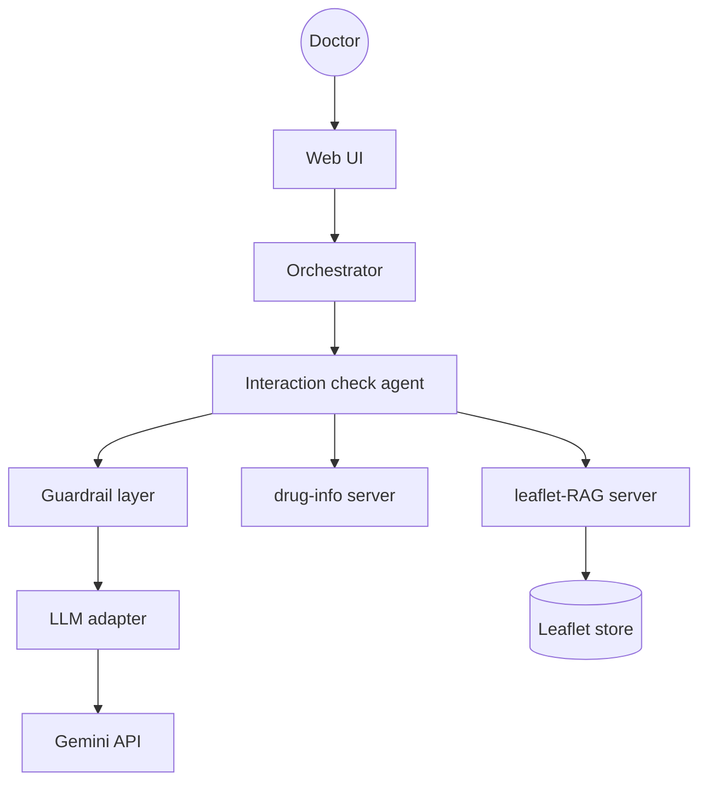
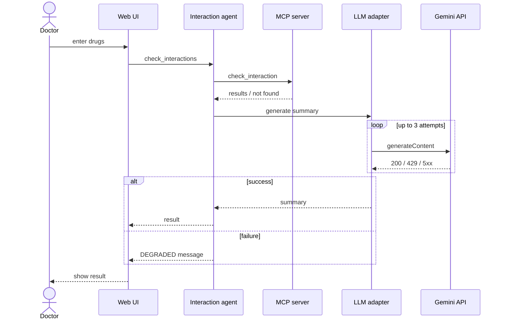
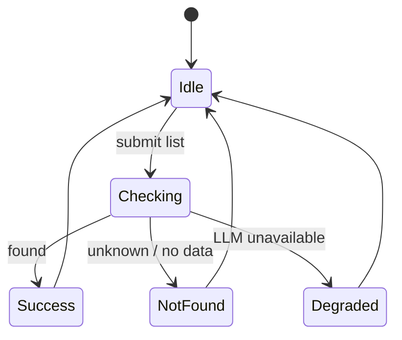
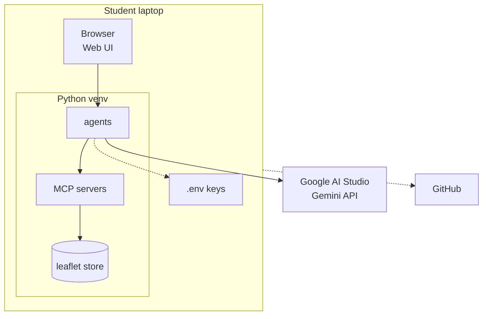

# UML Diagrams – MedRx Doctor

## Use Case

```mermaid
flowchart LR
    Doctor((Doctor))
    LLM((LLM provider))

    subgraph MedRx[MedRx - Doctor assistant]
        UC1[Enter drug list]
        UC2[Check interactions]
        UC3[Show severity + leaflet quote]
        UC4[Show full leaflet section]
        UC5[Handle unknown drug]
        UC6[Handle rate limit]
    end

    Doctor --> UC1
    Doctor --> UC2
    Doctor --> UC4
    UC2 --> UC3
    UC2 -.-> UC5
    UC2 -.-> UC6
    UC2 --> LLM
    UC3 --> LLM
```

## Component

```mermaid
flowchart TB
    Doctor((Doctor))
    UI[Web UI]
    ORCH[Orchestrator]
    CHECK[Interaction check agent]
    GUARD[Guardrail layer]
    LLMA[LLM adapter]
    DRUG[drug-info server]
    RAG[leaflet-RAG server]
    VS[(Leaflet store)]
    GEM[Gemini API]

    Doctor --> UI
    UI --> ORCH
    ORCH --> CHECK
    CHECK --> DRUG
    CHECK --> RAG
    RAG --> VS
    CHECK --> GUARD
    GUARD --> LLMA
    LLMA --> GEM
```

## Sequence (simplified)

```mermaid
sequenceDiagram
    actor Doctor
    participant UI as Web UI
    participant AG as Interaction agent
    participant MCP as MCP server
    participant LLM as LLM adapter
    participant GEM as Gemini API

    Doctor->>UI: enter drugs
    UI->>AG: check_interactions
    AG->>MCP: check_interaction
    MCP-->>AG: results / not found
    AG->>LLM: generate summary
    loop up to 3 attempts
        LLM->>GEM: generateContent
        GEM-->>LLM: 200 / 429 / 5xx
    end
    alt success
        LLM-->>AG: summary
        AG-->>UI: result
    else failure
        AG-->>UI: DEGRADED message
    end
    UI-->>Doctor: show result
```

## State Machine

```mermaid
stateDiagram-v2
    [*] --> Idle
    Idle --> Checking : submit list
    Checking --> Success : found
    Checking --> NotFound : unknown / no data
    Checking --> Degraded : LLM unavailable
    Success --> Idle
    NotFound --> Idle
    Degraded --> Idle
```

## Deployment

```mermaid
flowchart TB
    subgraph Laptop[Student laptop]
        Browser[Browser<br/>Web UI]
        subgraph Python[Python venv]
            Agents[agents]
            MCP[MCP servers]
            Store[(leaflet store)]
        end
        Env[.env keys]
    end
    Gemini[Google AI Studio<br/>Gemini API]
    GitHub[GitHub]

    Browser --> Agents
    Agents --> MCP
    MCP --> Store
    Agents --> Gemini
    Agents -.-> Env
    Laptop -.-> GitHub
```

---

PlantUML source files are also available in the same folder (`.puml`).
